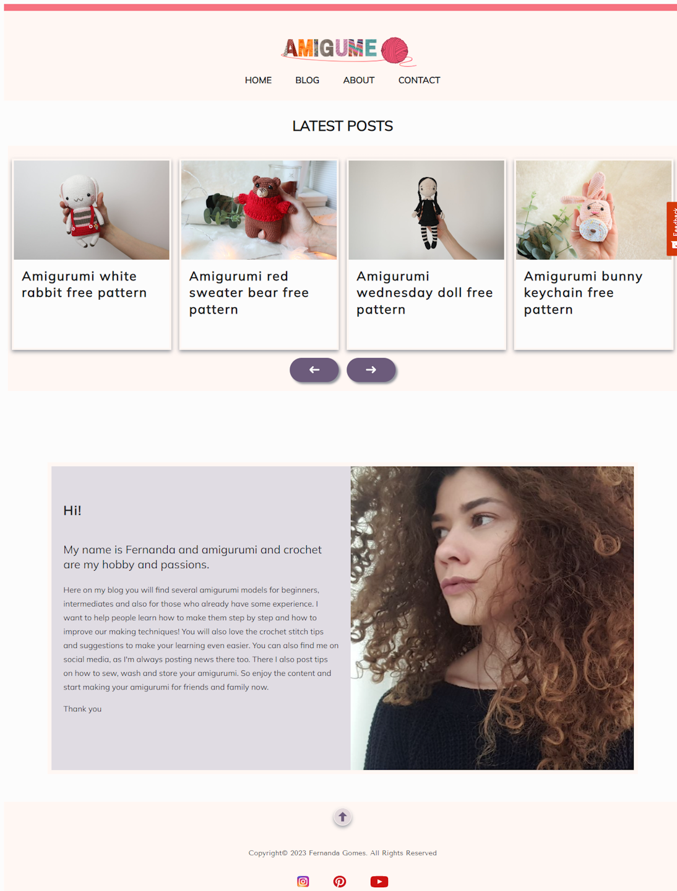
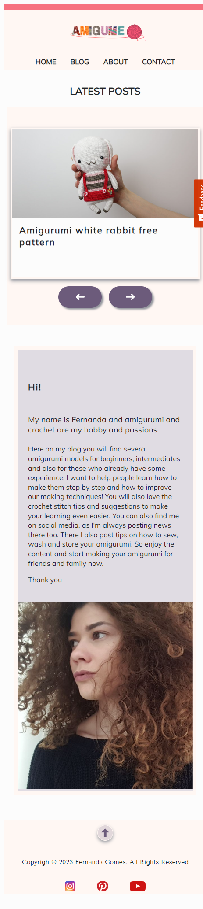

# Amigume Website

<!-- A simple overview of use/purpose. -->

A headless Wordpress REST API blog dedicated to my favorite subject - amigurumi!

## Noroff Project Exam 1 for Frontend development

_Brief_

The main goal of this repository is to implement a headless Wordpress REST API frontend blog of our chosen topic, deployed using Netlify.
HTML, CSS, and JavaScript: should be used to develop the site into a functional, well-presented website.
There were several criteria to be met, such as:

- a carousel with "Latest Posts",
- fetch dynamically the blog list with a `view more` functionality,
- fetch dynamically a specific blog post by ID,
- create a form with javascript validation rules.
- modal popups: `zoom image` in the blog post, `send message` confirmation.

All with neat semantics, responsiveness, and CSS that follows the DRY principle.
The site should be WCAG compliant, and accessibility should be taken into account.
The project didn't allow us to use any frameworks, so I had to code everything myself.

## Description

<!-- An in-depth paragraph about your project and overview of use. -->

The website design and implementation has been made with `Figma` and `HTML` & `CSS`:

- Trello: website task planning,
- Figma: `Personas` target audience, a flow with website structure, `Moonboard`,
- Figma: prototypes for mobile and desktop version (color, contrast, font, fonttype - UX/UI),
- Google fonts,
- Wireframes: medium-fidelity for mobile and desktop version,
- Semantic html 5,
- Responsive design (concepts, media queries, etc),
- DRY (css variables, structured code, etc),
- Image optimization,
- Accessibility concepts (WCAG),
- Developer tools (VS Code, Prettier, DevTools, Github, Netlify, etc),
- Code validation tools,
- WordPress: provided custom content for 20 posts,
- WordPress APIs: to allow the frontend to fetch the WordPress blog posts and related media,
- Local: Local WordPress development,
- Postman to work with REST APIs,
- JavaScript (calls to the WordPress REST APIs to fetch data, form validation rules, error handling),
- Usability Test UX:
  - Qualitative testing with user interviews,
  - Quantitative testing with Hotjar tool

The website code has been validated using the following tools:

- check html validity: <https://validator.w3.org/>
- check css validity: <https://jigsaw.w3.org/css-validator/>
- check redirect links: <https://validator.w3.org/checklink>
- check accessibility: <https://www.accessibilitychecker.org/>

## Dependencies

<!-- - Describe any prerequisites, libraries, OS version, etc., needed before installing the program.
- ex. Windows 10 -->

To develop the website I have used `Visual Studio Code` with `Prettier` formatter extension.

No other tools are required to compile or run the website.

Links:

- [Figma Desktop prototype](https://www.figma.com/proto/j9DCYn2nf9dLMGeTTmQz1v/Project-Exam-1?page-id=2239%3A3059&type=design&node-id=2258-11867&viewport=2155%2C779%2C0.11&t=hH3XxxUh9q8gsLA7-1&scaling=scale-down&starting-point-node-id=2258%3A11867&mode=design)
- [Figma Mobile prototype](https://www.figma.com/proto/j9DCYn2nf9dLMGeTTmQz1v/Project-Exam-1?page-id=2261%3A12627&type=design&node-id=2280-25876&viewport=500%2C304%2C0.06&t=FYc0BW1JcPRbyQFG-1&scaling=scale-down&starting-point-node-id=2280%3A25876&mode=design)
- [Netlify website](https://spectacular-smakager-27e9f9.netlify.app/)
